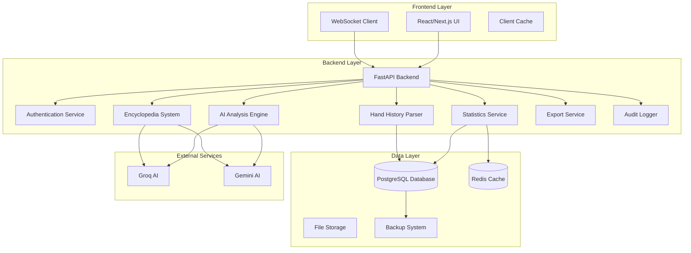
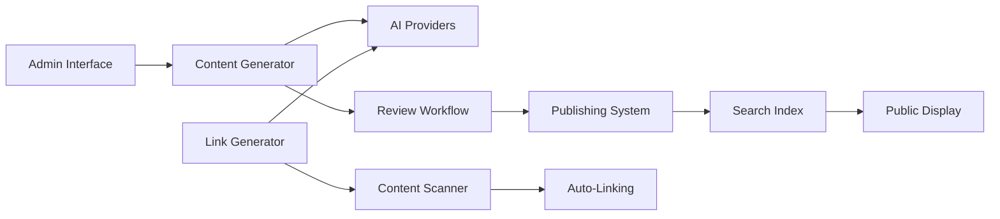
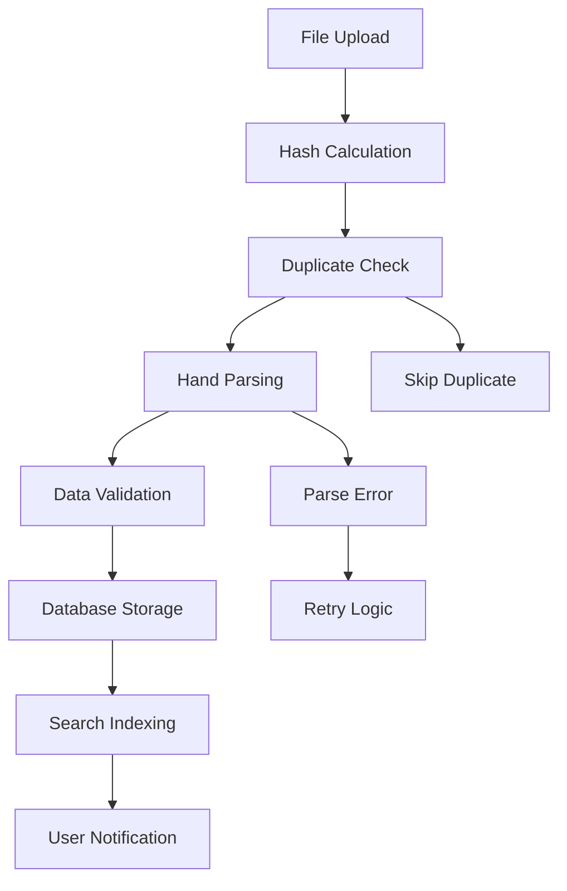

# Design Document: Poker App Fixes and Cleanup

## Overview

This design document outlines the technical architecture and implementation approach for fixing critical issues in the Professional Poker Analyzer application. The solution addresses 19 comprehensive requirements spanning user-facing fixes, data management improvements, and new production features.

The design focuses on reliability, accuracy, and user experience improvements while maintaining the existing application structure. Key areas include statistics loading reliability, date calculation accuracy, comprehensive encyclopedia management, real-time progress tracking, and robust data handling without mock data dependencies.

## Architecture

### High-Level Architecture

The application maintains its existing three-tier architecture with enhanced reliability and new capabilities:



### Enhanced Reliability Patterns

**Error Handling Strategy:**
- Exponential backoff for external service calls (1s, 2s, 4s delays)
- Circuit breaker pattern for AI provider failures
- Graceful degradation to cached data when services are unavailable
- Comprehensive error logging with context preservation

**Data Consistency:**
- ACID transactions for critical operations
- Optimistic locking for concurrent updates
- Data validation at multiple layers (client, API, database)
- Automatic integrity checking with repair capabilities

## Components and Interfaces

### Statistics Service Enhancement

**Purpose:** Provide reliable statistics loading with comprehensive error handling and caching.

**Key Interfaces:**
```typescript
interface StatisticsService {
  loadUserStatistics(userId: string, dateRange?: DateRange): Promise<Statistics>
  calculateDailyStats(userId: string, timezone: string): Promise<DailyStats>
  refreshStatistics(userId: string): Promise<void>
  validateStatisticsIntegrity(userId: string): Promise<ValidationResult>
}

interface Statistics {
  totalHands: number
  winRate: number
  profitLoss: number
  lastUpdated: Date
  dataIntegrity: IntegrityStatus
}
```

**Error Handling:**
- Retry logic with exponential backoff for database failures
- Fallback to cached statistics when real-time calculation fails
- Detailed error messages with suggested user actions
- Automatic data integrity validation before display

### Session Management System

**Purpose:** Track user sessions accurately for timezone-aware date calculations.

**Key Interfaces:**
```typescript
interface SessionManager {
  createSession(userId: string, timezone: string): Promise<Session>
  updateSessionActivity(sessionId: string): Promise<void>
  endSession(sessionId: string): Promise<void>
  getActiveSession(userId: string): Promise<Session | null>
  calculateDateBoundaries(userId: string): Promise<DateBoundaries>
}

interface Session {
  id: string
  userId: string
  startTime: Date
  lastActivity: Date
  timezone: string
  deviceInfo: DeviceInfo
}
```

**Implementation Details:**
- Session creation on login with timezone detection
- Periodic activity updates to maintain accurate session duration
- Timezone-aware date boundary calculations for statistics
- Multi-device session support with consistent timezone handling

### Dashboard Component Reliability

**Purpose:** Ensure consistent dashboard loading with partial failure handling.

**Key Features:**
- Independent widget loading with individual error boundaries
- Progressive loading with skeleton states
- Automatic retry for failed components
- Cached data fallback for offline scenarios

**Component Structure:**
```typescript
interface DashboardWidget {
  id: string
  title: string
  loadData(): Promise<WidgetData>
  renderError(error: Error): ReactNode
  renderLoading(): ReactNode
}

interface DashboardState {
  widgets: Map<string, WidgetState>
  globalError?: Error
  isRefreshing: boolean
}
```

### Encyclopedia Management System

**Purpose:** Comprehensive AI-powered encyclopedia with content generation, linking, and management.

**Architecture:**


**Key Interfaces:**
```typescript
interface EncyclopediaSystem {
  generateContent(topic: string, provider: AIProvider): Promise<ContentDraft>
  refineContent(draftId: string, prompt: string): Promise<ContentDraft>
  approveContent(draftId: string): Promise<EncyclopediaEntry>
  generateLinks(entryId: string): Promise<LinkSuggestion[]>
  scanForTopics(): Promise<TopicSuggestion[]>
  searchEntries(query: string): Promise<EncyclopediaEntry[]>
}

interface EncyclopediaEntry {
  id: string
  title: string
  content: string
  links: InternalLink[]
  status: 'draft' | 'published' | 'archived'
  aiProvider: string
  conversationHistory: ConversationThread[]
}
```

**Content Generation Workflow:**
1. Admin specifies topic and selects AI provider (Groq/Gemini)
2. AI generates initial content with conversation thread tracking
3. Iterative refinement through follow-up prompts
4. Admin review and approval workflow
5. Automatic link generation between related entries
6. Publication to searchable encyclopedia

### Hand History Processing Pipeline

**Purpose:** Reliable import, deduplication, and persistence of hand history data.

**Processing Flow:**


**Key Interfaces:**
```typescript
interface HandHistoryProcessor {
  processFile(file: File, userId: string): Promise<ProcessingResult>
  detectDuplicates(fileHash: string, userId: string): Promise<DuplicateInfo>
  parseHands(fileContent: string, format: FileFormat): Promise<Hand[]>
  validateHands(hands: Hand[]): Promise<ValidationResult>
  storeHands(hands: Hand[], userId: string): Promise<StorageResult>
}

interface ProcessingResult {
  totalHands: number
  newHands: number
  duplicates: number
  errors: ProcessingError[]
  processingTime: number
}
```

**Deduplication Strategy:**
- File-level deduplication using SHA-256 hashes
- Hand-level deduplication using composite keys (timestamp, table, seat)
- Intelligent merging for partial duplicates
- User confirmation for uncertain duplicates

### Real-Time Progress System

**Purpose:** Provide live updates for file processing and long-running operations.

**WebSocket Architecture:**
```typescript
interface RealTimeManager {
  establishConnection(userId: string): Promise<WebSocketConnection>
  broadcastProgress(userId: string, progress: ProgressUpdate): Promise<void>
  subscribeToProgress(userId: string, operationId: string): Promise<void>
  handleDisconnection(userId: string): Promise<void>
}

interface ProgressUpdate {
  operationId: string
  type: 'file_processing' | 'analysis' | 'export'
  progress: number // 0-100
  currentStep: string
  estimatedTimeRemaining?: number
  error?: ProgressError
}
```

**Implementation Features:**
- Persistent connection management with automatic reconnection
- Operation-specific progress tracking
- Batch processing status for multiple files
- Error propagation with recovery options

### Export and Backup System

**Purpose:** Comprehensive data export with multiple formats and automatic backup capabilities.

**Export Formats:**
- **JSON**: Complete data with metadata for programmatic access
- **CSV**: Tabular data for spreadsheet analysis
- **PDF**: Formatted reports for presentation

**Key Interfaces:**
```typescript
interface ExportService {
  exportUserData(userId: string, format: ExportFormat, options: ExportOptions): Promise<ExportJob>
  getExportStatus(jobId: string): Promise<ExportStatus>
  downloadExport(jobId: string): Promise<ExportFile>
  scheduleBackup(userId: string): Promise<BackupJob>
  restoreFromBackup(userId: string, backupId: string): Promise<RestoreResult>
}

interface ExportOptions {
  includeHandHistories: boolean
  includeAnalyses: boolean
  includeStatistics: boolean
  dateRange?: DateRange
  compressionLevel?: number
}
```

**Backup Strategy:**
- Automated daily backups with retention policies
- Point-in-time recovery capabilities
- Data integrity verification for all backups
- Incremental backups for large datasets

### Audit Logging System

**Purpose:** Comprehensive tracking of user actions and system events for troubleshooting and compliance.

**Logging Categories:**
- **User Actions**: Login, file upload, data deletion, settings changes
- **System Events**: Errors, performance issues, service failures
- **Data Changes**: Before/after states for critical modifications
- **Security Events**: Authentication failures, access violations

**Key Interfaces:**
```typescript
interface AuditLogger {
  logUserAction(userId: string, action: UserAction, context: ActionContext): Promise<void>
  logSystemEvent(event: SystemEvent, severity: LogSeverity): Promise<void>
  logDataChange(userId: string, change: DataChange): Promise<void>
  queryLogs(criteria: LogQuery): Promise<LogEntry[]>
}

interface LogEntry {
  id: string
  timestamp: Date
  userId?: string
  category: LogCategory
  action: string
  details: Record<string, any>
  severity: LogSeverity
}
```

## Data Models

### Enhanced User Session Model

```sql
CREATE TABLE user_sessions (
    id UUID PRIMARY KEY DEFAULT gen_random_uuid(),
    user_id UUID NOT NULL REFERENCES users(id),
    start_time TIMESTAMP WITH TIME ZONE NOT NULL DEFAULT NOW(),
    end_time TIMESTAMP WITH TIME ZONE,
    last_activity TIMESTAMP WITH TIME ZONE NOT NULL DEFAULT NOW(),
    timezone VARCHAR(50) NOT NULL,
    device_info JSONB,
    ip_address INET,
    created_at TIMESTAMP WITH TIME ZONE DEFAULT NOW(),
    updated_at TIMESTAMP WITH TIME ZONE DEFAULT NOW()
);
```

### Encyclopedia System Models

```sql
CREATE TABLE encyclopedia_entries (
    id UUID PRIMARY KEY DEFAULT gen_random_uuid(),
    title VARCHAR(255) NOT NULL UNIQUE,
    content TEXT NOT NULL,
    status VARCHAR(20) NOT NULL DEFAULT 'draft',
    ai_provider VARCHAR(50) NOT NULL,
    created_by UUID NOT NULL REFERENCES users(id),
    approved_by UUID REFERENCES users(id),
    created_at TIMESTAMP WITH TIME ZONE DEFAULT NOW(),
    updated_at TIMESTAMP WITH TIME ZONE DEFAULT NOW(),
    published_at TIMESTAMP WITH TIME ZONE
);

CREATE TABLE encyclopedia_conversations (
    id UUID PRIMARY KEY DEFAULT gen_random_uuid(),
    entry_id UUID NOT NULL REFERENCES encyclopedia_entries(id),
    prompt TEXT NOT NULL,
    response TEXT NOT NULL,
    ai_provider VARCHAR(50) NOT NULL,
    created_at TIMESTAMP WITH TIME ZONE DEFAULT NOW()
);

CREATE TABLE encyclopedia_links (
    id UUID PRIMARY KEY DEFAULT gen_random_uuid(),
    source_entry_id UUID NOT NULL REFERENCES encyclopedia_entries(id),
    target_entry_id UUID NOT NULL REFERENCES encyclopedia_entries(id),
    anchor_text VARCHAR(255) NOT NULL,
    context TEXT,
    created_at TIMESTAMP WITH TIME ZONE DEFAULT NOW()
);
```

### File Processing Models

```sql
CREATE TABLE file_uploads (
    id UUID PRIMARY KEY DEFAULT gen_random_uuid(),
    user_id UUID NOT NULL REFERENCES users(id),
    filename VARCHAR(255) NOT NULL,
    file_hash VARCHAR(64) NOT NULL,
    file_size BIGINT NOT NULL,
    mime_type VARCHAR(100),
    upload_status VARCHAR(20) NOT NULL DEFAULT 'pending',
    processing_started_at TIMESTAMP WITH TIME ZONE,
    processing_completed_at TIMESTAMP WITH TIME ZONE,
    hands_processed INTEGER DEFAULT 0,
    hands_duplicated INTEGER DEFAULT 0,
    error_message TEXT,
    created_at TIMESTAMP WITH TIME ZONE DEFAULT NOW()
);

CREATE TABLE processing_progress (
    id UUID PRIMARY KEY DEFAULT gen_random_uuid(),
    operation_id UUID NOT NULL,
    user_id UUID NOT NULL REFERENCES users(id),
    operation_type VARCHAR(50) NOT NULL,
    progress_percentage INTEGER NOT NULL DEFAULT 0,
    current_step VARCHAR(255),
    estimated_completion TIMESTAMP WITH TIME ZONE,
    error_details JSONB,
    created_at TIMESTAMP WITH TIME ZONE DEFAULT NOW(),
    updated_at TIMESTAMP WITH TIME ZONE DEFAULT NOW()
);
```

### Audit Logging Models

```sql
CREATE TABLE audit_logs (
    id UUID PRIMARY KEY DEFAULT gen_random_uuid(),
    user_id UUID REFERENCES users(id),
    category VARCHAR(50) NOT NULL,
    action VARCHAR(100) NOT NULL,
    resource_type VARCHAR(50),
    resource_id UUID,
    details JSONB,
    severity VARCHAR(20) NOT NULL DEFAULT 'info',
    ip_address INET,
    user_agent TEXT,
    created_at TIMESTAMP WITH TIME ZONE DEFAULT NOW()
);

CREATE INDEX idx_audit_logs_user_id ON audit_logs(user_id);
CREATE INDEX idx_audit_logs_category ON audit_logs(category);
CREATE INDEX idx_audit_logs_created_at ON audit_logs(created_at);
```

### Export and Backup Models

```sql
CREATE TABLE export_jobs (
    id UUID PRIMARY KEY DEFAULT gen_random_uuid(),
    user_id UUID NOT NULL REFERENCES users(id),
    export_type VARCHAR(50) NOT NULL,
    format VARCHAR(10) NOT NULL,
    options JSONB NOT NULL,
    status VARCHAR(20) NOT NULL DEFAULT 'pending',
    file_path VARCHAR(500),
    file_size BIGINT,
    started_at TIMESTAMP WITH TIME ZONE,
    completed_at TIMESTAMP WITH TIME ZONE,
    expires_at TIMESTAMP WITH TIME ZONE,
    error_message TEXT,
    created_at TIMESTAMP WITH TIME ZONE DEFAULT NOW()
);

CREATE TABLE data_backups (
    id UUID PRIMARY KEY DEFAULT gen_random_uuid(),
    user_id UUID REFERENCES users(id),
    backup_type VARCHAR(50) NOT NULL,
    file_path VARCHAR(500) NOT NULL,
    file_size BIGINT NOT NULL,
    checksum VARCHAR(64) NOT NULL,
    retention_until TIMESTAMP WITH TIME ZONE NOT NULL,
    created_at TIMESTAMP WITH TIME ZONE DEFAULT NOW()
);
```
## Correctness Properties

*A property is a characteristic or behavior that should hold true across all valid executions of a system—essentially, a formal statement about what the system should do. Properties serve as the bridge between human-readable specifications and machine-verifiable correctness guarantees.*

### Property 1: Statistics Loading Reliability
*For any* user with valid credentials, when accessing the statistics page, the system should successfully load and display statistics within reasonable time bounds, implement proper retry logic with exponential backoff on failures, validate data integrity before display, and gracefully degrade to cached data when real-time calculation fails.
**Validates: Requirements 1.1, 1.2, 1.3, 1.4, 1.5**

### Property 2: Timezone-Aware Date Calculations  
*For any* user timezone and date boundary scenario, the system should correctly calculate daily statistics using the user's local timezone, properly attribute hands to their respective calendar days based on timestamps, and recalculate statistics when system time changes occur.
**Validates: Requirements 2.2, 2.3, 2.4, 2.5**

### Property 3: Dashboard Component Reliability
*For any* dashboard loading scenario, all statistical widgets should render successfully with reasonable performance, display partial data with clear error indicators when individual components fail, show appropriate loading states during data fetching, and maintain user view state during refresh operations.
**Validates: Requirements 3.1, 3.2, 3.3, 3.4, 3.5**

### Property 4: Encyclopedia Content Workflow
*For any* encyclopedia entry creation and management workflow, the system should maintain conversation threads during AI content generation, provide proper approval workflows with version control, automatically generate inter-entry links, and support iterative content refinement through follow-up prompts.
**Validates: Requirements 4.2, 4.3, 4.4, 4.5**

### Property 5: Educational Link Integration
*For any* technical poker term appearing in the interface, the system should provide clickable links with hover previews, display definitions in modals without navigation, include context-appropriate examples, and gracefully degrade to tooltips when content is unavailable.
**Validates: Requirements 5.1, 5.2, 5.3, 5.4, 5.5**

### Property 6: Analysis Result Accuracy
*For any* uploaded hand history data, the analysis engine should process actual user data (never mock data), generate results that directly correlate to uploaded files, validate calculations match source data, aggregate results accurately across multiple files, and implement AI provider failover when services are unavailable.
**Validates: Requirements 6.1, 6.2, 6.4, 6.5, 6.6**

### Property 7: Hand History Persistence
*For any* hand history file upload (drag-and-drop or file selection), the system should store files persistently in the database, maintain referential integrity between hands/sessions/analyses, provide dedicated viewing interfaces, and properly cascade deletions when users remove hand data.
**Validates: Requirements 7.1, 7.2, 7.4, 7.5, 7.6**

### Property 8: Comprehensive Duplicate Prevention
*For any* file or hand data upload, the system should detect duplicates using multiple methods (file hashes, hand identifiers), prevent storage of identical data, provide intelligent merging for partial duplicates, prompt users for confirmation in uncertain cases, and maintain accurate duplicate reporting.
**Validates: Requirements 7.3, 8.1, 8.2, 8.3, 8.4, 8.5, 14.1, 14.2, 14.3, 14.4, 14.5**

### Property 9: Hand History Management Interface
*For any* stored hand history data, the management interface should display searchable lists of all hands, provide filtering by date/stakes/game type/venue, show detailed hand information when selected, support bulk operations with confirmation prompts, and update related statistics in real-time when data is modified.
**Validates: Requirements 9.2, 9.3, 9.4, 9.5**

### Property 10: Configurable Automatic Scanning
*For any* automatic scanning configuration, the system should respect user settings for enabling/disabling automatic scans, trigger scans appropriately based on configuration (sign-in/refresh when enabled, manual only when disabled), check configured directories for new files, and prompt users before processing discovered files.
**Validates: Requirements 10.2, 10.3, 10.4, 10.5**

### Property 11: Production-Ready Data Handling
*For any* system operation, the application should function correctly with empty databases, provide clean slates for new accounts without test data, display appropriate empty states when no real data exists, and ensure analysis and statistics only use actual user-provided data.
**Validates: Requirements 11.1, 11.2, 11.3, 11.4, 11.5**

### Property 12: Database Schema Integrity
*For any* database schema validation or migration, the system should detect orphaned records and constraint violations, provide migration scripts that preserve existing data, ensure compatibility between new and existing structures, and generate comprehensive integrity reports.
**Validates: Requirements 12.2, 12.3, 12.4, 12.5**

### Property 13: Session Tracking Accuracy
*For any* user login session, the system should create session records with proper timezone information, use session data for accurate date boundary calculations, record session end times properly, handle concurrent multi-device sessions consistently, and provide accurate time-based filtering for reports.
**Validates: Requirements 13.1, 13.2, 13.3, 13.4, 13.5**

### Property 14: Real-Time Progress Tracking
*For any* long-running operation (file processing, analysis, export), the system should establish WebSocket connections for live updates, broadcast progress with percentage/step/time estimates, immediately notify users of errors with recovery options, track individual and batch progress for multiple operations, and restore progress state when users reconnect.
**Validates: Requirements 15.1, 15.2, 15.3, 15.4, 15.5**

### Property 15: Comprehensive Audit Logging
*For any* important user action or system event, the audit logger should record detailed logs with timestamps and context, capture comprehensive error information including stack traces, maintain before/after audit trails for data changes, and provide searchable interfaces with proper access controls.
**Validates: Requirements 16.1, 16.2, 16.3, 16.4, 16.5**

### Property 16: Multi-Format Data Export
*For any* data export request, the system should provide multiple format options (JSON/CSV/PDF), include complete data with metadata and analysis results, preserve all components of AI-generated content, handle large exports with background processing and notifications, and include integrity checksums for verification.
**Validates: Requirements 17.1, 17.2, 17.3, 17.4, 17.5, 17.6**

### Property 17: Data Recovery and Backup
*For any* data corruption or accidental deletion scenario, the system should automatically attempt recovery from backups, provide user-accessible recovery options within reasonable timeframes, maintain data consistency during failures with rollback capabilities, verify backup integrity with failure alerts, and present clear recovery options with impact assessment.
**Validates: Requirements 18.1, 18.2, 18.3, 18.4, 18.5**

### Property 18: Workspace Organization
*For any* workspace cleanup operation, the system should create backup directories before modifications, archive legacy files while preserving version history, consolidate duplicate files with reference updates, organize scattered tests into unified directory structures with proper import paths, and generate detailed summary reports of all changes.
**Validates: Requirements 19.1, 19.2, 19.3, 19.4, 19.5**

## Error Handling

### Comprehensive Error Strategy

The application implements a multi-layered error handling approach designed for reliability and user experience:

**Layer 1: Client-Side Error Boundaries**
- React Error Boundaries catch component-level failures
- Graceful degradation with partial UI functionality
- User-friendly error messages with recovery actions
- Automatic error reporting to monitoring systems

**Layer 2: API Error Handling**
- Standardized error response format across all endpoints
- HTTP status codes with detailed error descriptions
- Retry-able vs non-retry-able error classification
- Rate limiting with exponential backoff guidance

**Layer 3: Service-Level Error Recovery**
- Circuit breaker pattern for external service calls
- Automatic failover between AI providers (Groq ↔ Gemini)
- Database connection pooling with retry logic
- Cache fallback for critical data access

**Layer 4: Infrastructure Error Management**
- WebSocket reconnection with exponential backoff
- File processing error recovery with partial success handling
- Database transaction rollback on constraint violations
- Backup system activation on data corruption detection

### Specific Error Scenarios

**Statistics Loading Failures:**
- Network timeouts → Retry with exponential backoff (1s, 2s, 4s)
- Database unavailable → Serve cached statistics with staleness indicator
- Data corruption → Trigger integrity check and repair process
- Empty dataset → Display guided onboarding for data import

**File Processing Errors:**
- Unsupported format → Clear error message with supported format list
- Corrupted file → Attempt partial recovery and report salvageable data
- Duplicate detection uncertainty → Present side-by-side comparison for user decision
- Processing timeout → Convert to background job with progress notifications

**AI Provider Failures:**
- Primary provider unavailable → Automatic failover to secondary provider
- Rate limit exceeded → Queue requests with estimated processing time
- Invalid response format → Retry with different prompt strategy
- Complete provider failure → Graceful degradation to cached content

**Real-Time Connection Issues:**
- WebSocket disconnection → Automatic reconnection with exponential backoff
- Message delivery failure → Store updates locally and sync on reconnection
- Progress tracking loss → Reconstruct state from database checkpoints
- Concurrent connection conflicts → Merge state with conflict resolution

## Testing Strategy

### Dual Testing Approach

The testing strategy employs both unit testing and property-based testing to ensure comprehensive coverage and correctness validation.

**Unit Testing Focus:**
- Specific examples demonstrating correct behavior
- Edge cases and boundary conditions
- Integration points between components
- Error condition handling and recovery
- User interface interactions and state management

**Property-Based Testing Focus:**
- Universal properties that hold across all inputs
- Comprehensive input coverage through randomization
- Data integrity and consistency validation
- Performance characteristics under load
- Correctness of mathematical calculations and aggregations

### Property-Based Testing Configuration

**Testing Framework:** 
- Backend: Hypothesis (Python) for comprehensive property testing
- Frontend: fast-check (TypeScript) for UI and client-side logic testing
- Integration: Custom property generators for domain-specific testing

**Test Configuration:**
- Minimum 100 iterations per property test (due to randomization)
- Configurable iteration counts for performance-sensitive tests
- Seed-based reproducibility for debugging failed test cases
- Shrinking enabled to find minimal failing examples

**Property Test Implementation:**
Each correctness property must be implemented as a single property-based test with the following tag format:
```python
# Feature: poker-app-fixes-and-cleanup, Property 1: Statistics Loading Reliability
def test_statistics_loading_reliability_property():
    # Property implementation
```

### Testing Categories

**Reliability Testing:**
- Statistics loading under various network conditions
- Dashboard component failure and recovery scenarios
- File processing with corrupted or malformed data
- WebSocket connection stability and reconnection logic

**Accuracy Testing:**
- Date calculation across timezone boundaries and DST changes
- Hand history parsing and duplicate detection algorithms
- Analysis result correlation with source data
- Export data integrity and format compliance

**Performance Testing:**
- Large file processing with progress tracking
- Concurrent user session handling
- Database query optimization validation
- Cache effectiveness and invalidation strategies

**Security Testing:**
- User session isolation and data access controls
- Audit logging completeness and tamper resistance
- File upload validation and sanitization
- Data export access control and encryption

### Integration Testing Strategy

**End-to-End Workflows:**
- Complete hand history import and analysis pipeline
- Encyclopedia content creation and publication workflow
- User session lifecycle with timezone handling
- Data export and backup/recovery procedures

**Cross-Component Integration:**
- Statistics service integration with session management
- Real-time progress updates across WebSocket connections
- Audit logging integration with all user actions
- Error handling coordination across service boundaries

**External Service Integration:**
- AI provider failover and response handling
- Database backup and recovery system validation
- File storage and retrieval operations
- Email notification system for long-running operations

The testing strategy ensures that all 18 correctness properties are validated through automated testing, providing confidence in system reliability and correctness across all supported use cases.