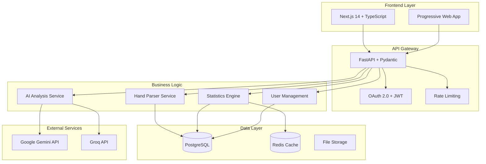

# Design Document

## Overview

The Professional Poker Analyzer Rebuild transforms the existing Flask prototype into a modern, scalable, enterprise-grade poker analysis platform. The system uses a microservices-inspired architecture with Next.js frontend, FastAPI backend, PostgreSQL database, and Redis caching, providing professional poker analysis through Gemini and Groq AI providers.

## Architecture

### High-Level Architecture



### Technology Stack

**Frontend:**
- Next.js 14 with App Router
- TypeScript for type safety
- Tailwind CSS for styling
- Shadcn/ui for components
- React Query for state management
- Chart.js/Recharts for visualizations

**Backend:**
- FastAPI with async/await
- Pydantic for validation
- SQLAlchemy 2.0 with async support
- Alembic for migrations
- Redis for caching
- Celery for background tasks

**Database:**
- PostgreSQL 15+ as primary database
- Redis for caching and sessions
- Proper indexing and query optimization

**Infrastructure:**
- Docker containers
- Docker Compose for development
- Environment-based configuration
- Structured logging

## Components and Interfaces

### Frontend Components

#### Core UI Components
```typescript
// Component hierarchy
App
├── Layout
│   ├── Navigation
│   ├── Sidebar
│   └── Footer
├── Pages
│   ├── Dashboard
│   ├── HandAnalysis
│   ├── Statistics
│   ├── Education
│   ├── Settings
│   └── Profile
└── Shared
    ├── PokerCard
    ├── StatCard
    ├── Chart
    ├── DataTable
    └── LoadingSpinner
```

#### Key Interfaces
```typescript
interface User {
  id: string;
  email: string;
  preferences: UserPreferences;
  apiKeys: {
    gemini?: string;
    groq?: string;
  };
  handHistoryPaths: {
    pokerstars?: string;
    ggpoker?: string;
  };
}

interface PokerHand {
  id: string;
  handId: string;
  platform: 'pokerstars' | 'ggpoker';
  gameType: string;
  gameFormat: string; // Tournament, Cash Game, Sit & Go
  stakes: string;
  blinds: { small: number; big: number; ante?: number };
  tableSize: number; // 2-max, 6-max, 9-max, etc.
  playerCards: string[];
  boardCards: string[];
  position: string;
  seatNumber: number;
  buttonPosition: number;
  actions: DetailedAction[];
  result: HandResult;
  potSize: number;
  rake: number;
  jackpotContribution?: number;
  tournamentInfo?: TournamentInfo;
  cashGameInfo?: CashGameInfo;
  playerStacks: PlayerStack[];
  timebank: TimebankInfo[];
  handDuration: number;
  timestamp: Date;
  timezone: string;
  currency: string;
  isPlayMoney: boolean;
  analysis?: AIAnalysis[];
  rawText: string; // Original hand history text
}

interface DetailedAction {
  player: string;
  action: 'fold' | 'check' | 'call' | 'bet' | 'raise' | 'all-in';
  amount?: number;
  street: 'preflop' | 'flop' | 'turn' | 'river';
  position: string;
  timeUsed?: number;
  timebankUsed?: number;
  isAllIn: boolean;
  stackAfter: number;
}

interface Statistics {
  // Basic Stats
  vpip: number;
  pfr: number;
  aggressionFactor: number;
  winRate: number;
  
  // Advanced Preflop Stats
  threeBetPercentage: number;
  foldToThreeBet: number;
  fourBetPercentage: number;
  foldToFourBet: number;
  coldCallPercentage: number;
  isolationRaise: number;
  
  // Postflop Stats
  cBetFlop: number;
  cBetTurn: number;
  cBetRiver: number;
  foldToCBetFlop: number;
  foldToCBetTurn: number;
  foldToCBetRiver: number;
  checkRaiseFlop: number;
  checkRaiseTurn: number;
  checkRaiseRiver: number;
  
  // Positional Stats
  positionStats: PositionStats[];
  
  // Tournament Specific
  tournamentStats?: TournamentStats;
  
  // Time-based Analysis
  trends: TrendData[];
  sessionStats: SessionStats[];
  
  // Advanced Metrics
  redLineWinnings: number; // Non-showdown winnings
  blueLineWinnings: number; // Showdown winnings
  expectedValue: number;
  variance: number;
  standardDeviations: number;
}
```

### Backend Services

#### API Layer
```python
# FastAPI application structure
app/
├── main.py              # FastAPI app initialization
├── api/
│   ├── v1/
│   │   ├── auth.py      # Authentication endpoints
│   │   ├── hands.py     # Hand history endpoints
│   │   ├── stats.py     # Statistics endpoints
│   │   ├── analysis.py  # AI analysis endpoints
│   │   └── users.py     # User management endpoints
├── core/
│   ├── config.py        # Configuration management
│   ├── security.py      # Security utilities
│   └── database.py      # Database connection
├── services/
│   ├── hand_parser.py   # Multi-platform hand parsing
│   ├── file_watcher.py  # Directory monitoring
│   ├── statistics.py    # Comprehensive statistics calculation
│   ├── ai_analysis.py   # AI provider integration with YAML prompts
│   ├── education.py     # Poker education content
│   └── user_service.py  # User management
└── models/
    ├── user.py          # User database models
    ├── hand.py          # Hand database models
    └── analysis.py      # Analysis database models
```

#### Service Interfaces
```python
class HandParserService:
    async def parse_pokerstars_file(self, file_content: str) -> List[PokerHand]:
        """Parse PokerStars hand history file format."""
        
    async def parse_ggpoker_file(self, file_content: str) -> List[PokerHand]:
        """Parse GGPoker hand history file format."""
        
    async def auto_detect_platform(self, file_content: str) -> str:
        """Automatically detect poker platform from file format."""
        
    async def validate_hand(self, hand: PokerHand) -> bool:
        """Validate hand data integrity."""
        
    async def scan_directory(self, directory_path: str) -> List[str]:
        """Scan directory for hand history files."""

class FileWatcherService:
    async def watch_pokerstars_directory(self, user_id: str) -> None:
        """Monitor PokerStars hand history directory for new files."""
        
    async def watch_ggpoker_directory(self, user_id: str) -> None:
        """Monitor GGPoker hand history directory for new files."""
        
    async def get_default_paths(self, platform: str) -> List[str]:
        """Get default hand history paths for each platform."""

class StatisticsService:
    async def calculate_comprehensive_stats(self, user_id: str, filters: StatFilters) -> Statistics:
        """Calculate all poker statistics including advanced metrics."""
        
    async def calculate_tournament_stats(self, user_id: str) -> TournamentStats:
        """Calculate tournament-specific statistics."""
        
    async def get_trends(self, user_id: str, period: TimePeriod) -> TrendData:
        """Get performance trends over time."""

class AIAnalysisService:
    def __init__(self):
        self.prompts = self._load_prompts_from_yaml()
    
    async def analyze_hand(self, hand: PokerHand, provider: str, api_key: str) -> AIAnalysis:
        """Analyze single hand using specified AI provider."""
        
    async def analyze_session(self, hands: List[PokerHand], provider: str, api_key: str) -> SessionAnalysis:
        """Analyze multiple hands for session insights."""
        
    def _load_prompts_from_yaml(self) -> Dict[str, str]:
        """Load AI prompts from YAML configuration files."""
```

## Data Models

### Database Schema

```sql
-- Users table
CREATE TABLE users (
    id UUID PRIMARY KEY DEFAULT gen_random_uuid(),
    email VARCHAR(255) UNIQUE NOT NULL,
    password_hash VARCHAR(255) NOT NULL,
    api_keys JSONB DEFAULT '{}', -- Store encrypted API keys for both providers
    hand_history_paths JSONB DEFAULT '{}', -- Store paths for both platforms
    preferences JSONB DEFAULT '{}',
    created_at TIMESTAMP DEFAULT NOW(),
    updated_at TIMESTAMP DEFAULT NOW()
);

-- Enhanced poker hands table with comprehensive data
CREATE TABLE poker_hands (
    id UUID PRIMARY KEY DEFAULT gen_random_uuid(),
    user_id UUID REFERENCES users(id) ON DELETE CASCADE,
    hand_id VARCHAR(50) NOT NULL,
    platform VARCHAR(20) NOT NULL, -- 'pokerstars' or 'ggpoker'
    game_type VARCHAR(100),
    game_format VARCHAR(50), -- 'tournament', 'cash', 'sng'
    stakes VARCHAR(50),
    blinds JSONB, -- {small: 0.5, big: 1.0, ante: 0.1}
    table_size INTEGER,
    date_played TIMESTAMP,
    player_cards TEXT[],
    board_cards TEXT[],
    position VARCHAR(20),
    seat_number INTEGER,
    button_position INTEGER,
    actions JSONB, -- Detailed action array
    result VARCHAR(20),
    pot_size DECIMAL(10,2),
    rake DECIMAL(10,2),
    jackpot_contribution DECIMAL(10,2),
    tournament_info JSONB, -- Tournament ID, level, etc.
    cash_game_info JSONB, -- Table info, etc.
    player_stacks JSONB, -- All player stack sizes
    timebank_info JSONB, -- Time usage data
    hand_duration INTEGER, -- Seconds
    timezone VARCHAR(50),
    currency VARCHAR(10),
    is_play_money BOOLEAN DEFAULT false,
    raw_text TEXT,
    created_at TIMESTAMP DEFAULT NOW(),
    UNIQUE(user_id, hand_id, platform)
);

-- Analysis results table (multiple analyses per hand)
CREATE TABLE analysis_results (
    id UUID PRIMARY KEY DEFAULT gen_random_uuid(),
    hand_id UUID REFERENCES poker_hands(id) ON DELETE CASCADE,
    ai_provider VARCHAR(20),
    prompt_version VARCHAR(50), -- Track which prompt version was used
    analysis_text TEXT,
    strengths TEXT[],
    mistakes TEXT[],
    recommendations TEXT[],
    confidence_score DECIMAL(3,2),
    analysis_metadata JSONB, -- Store additional analysis data
    created_at TIMESTAMP DEFAULT NOW()
);

-- Comprehensive statistics cache
CREATE TABLE statistics_cache (
    id UUID PRIMARY KEY DEFAULT gen_random_uuid(),
    user_id UUID REFERENCES users(id) ON DELETE CASCADE,
    cache_key VARCHAR(255),
    stat_type VARCHAR(50), -- 'basic', 'advanced', 'tournament', etc.
    data JSONB,
    expires_at TIMESTAMP,
    created_at TIMESTAMP DEFAULT NOW(),
    UNIQUE(user_id, cache_key)
);

-- File monitoring table
CREATE TABLE file_monitoring (
    id UUID PRIMARY KEY DEFAULT gen_random_uuid(),
    user_id UUID REFERENCES users(id) ON DELETE CASCADE,
    platform VARCHAR(20),
    directory_path TEXT,
    last_scan TIMESTAMP,
    file_count INTEGER DEFAULT 0,
    is_active BOOLEAN DEFAULT true,
    created_at TIMESTAMP DEFAULT NOW()
);

-- Enhanced indexes for performance
CREATE INDEX idx_poker_hands_user_platform_date ON poker_hands(user_id, platform, date_played DESC);
CREATE INDEX idx_poker_hands_game_format ON poker_hands(game_format);
CREATE INDEX idx_poker_hands_stakes ON poker_hands(stakes);
CREATE INDEX idx_poker_hands_position ON poker_hands(position);
CREATE INDEX idx_analysis_results_hand_provider ON analysis_results(hand_id, ai_provider);
CREATE INDEX idx_statistics_cache_user_type ON statistics_cache(user_id, stat_type);
CREATE INDEX idx_file_monitoring_user_platform ON file_monitoring(user_id, platform);
```

### Caching Strategy

```python
# Redis cache keys and TTL
CACHE_KEYS = {
    'user_stats': 'stats:user:{user_id}:{filters_hash}',  # TTL: 1 hour
    'hand_analysis': 'analysis:hand:{hand_hash}',         # TTL: 24 hours
    'session_data': 'session:user:{user_id}:{date}',     # TTL: 6 hours
    'ai_response': 'ai:{provider}:{prompt_hash}',        # TTL: 7 days
}
```

## Correctness Properties

*A property is a characteristic or behavior that should hold true across all valid executions of a system-essentially, a formal statement about what the system should do. Properties serve as the bridge between human-readable specifications and machine-verifiable correctness guarantees.*

<function_calls>
<invoke name="prework">
<parameter name="featureName">professional-poker-analyzer-rebuild

### Property Reflection

After analyzing all acceptance criteria, I identified several areas where properties can be consolidated:

**Caching Properties**: Properties 4.5, 4.8, and 9.4 all relate to caching behavior and can be combined into comprehensive caching properties.

**Security Properties**: Properties 8.3, 8.6, and 8.7 all relate to security measures and can be grouped.

**Performance Properties**: Properties 4.4, 9.1, and 9.2 are all performance-related and can be consolidated.

**AI Analysis Properties**: Properties 7.1, 7.2, 7.4, 7.6, and 7.7 all relate to AI analysis output and can be combined.

**Data Validation Properties**: Properties 5.3, 5.4, 5.5, and 5.8 all relate to data processing and validation.

### Correctness Properties

Property 1: AI Provider Selection Flexibility
*For any* analysis request, users should be able to choose between Gemini and Groq providers at execution time, and the system should validate the selected provider's API key before processing
**Validates: Requirements 1.2, 1.3, 1.4**

Property 2: API Key Security
*For any* API key storage or logging operation, the system should encrypt sensitive data and never expose API keys in logs or configuration files
**Validates: Requirements 1.6, 8.3**

Property 3: Provider Switching Data Persistence
*For any* AI provider change, the system should maintain all historical analysis data and allow users to access previous results regardless of current provider selection
**Validates: Requirements 1.7**

Property 4: Responsive UI Behavior
*For any* viewport size (desktop, tablet, mobile), all UI components should render correctly and maintain functionality across different screen dimensions
**Validates: Requirements 2.2**

Property 5: Loading State Consistency
*For any* data loading operation, the system should display appropriate loading indicators and handle loading states gracefully until completion or error
**Validates: Requirements 2.5**

Property 6: Error Boundary Protection
*For any* runtime error in the frontend, the system should catch the error gracefully and display user-friendly error messages without crashing the application
**Validates: Requirements 2.6**

Property 7: API Request Validation
*For any* API request with invalid data, the system should reject the request with proper validation errors and detailed feedback about what needs to be corrected
**Validates: Requirements 3.4**

Property 8: System Event Logging
*For any* significant system operation (authentication, data processing, errors), appropriate log entries should be generated with proper detail levels and structured format
**Validates: Requirements 3.8**

Property 9: Data Storage Consistency
*For any* hand history parsing operation, all extracted data should be stored in the database with proper structure and indexing for efficient retrieval
**Validates: Requirements 4.2**

Property 10: Comprehensive Caching Strategy
*For any* frequently accessed data (statistics, analysis results, user preferences), the system should implement appropriate caching with proper TTL and cache invalidation strategies
**Validates: Requirements 4.5, 4.8, 9.4**

Property 11: Database Concurrency Safety
*For any* concurrent database operations, the system should maintain data integrity through proper transaction management and prevent race conditions
**Validates: Requirements 4.7**

Property 12: Hand Parsing Accuracy and Error Handling
*For any* hand history file processing, the system should parse valid hands accurately, handle parsing errors gracefully, detect duplicates, and validate data integrity
**Validates: Requirements 5.3, 5.4, 5.5, 5.8**

Property 13: Asynchronous Processing with Progress
*For any* long-running operation (file parsing, batch analysis), the system should process asynchronously and provide real-time progress updates to users
**Validates: Requirements 5.2**

Property 14: Statistical Calculation Accuracy
*For any* set of poker hands, the system should calculate all poker statistics (VPIP, PFR, aggression, advanced metrics) with mathematical accuracy and proper handling of edge cases
**Validates: Requirements 6.1, 6.6**

Property 15: Dynamic Statistics Filtering
*For any* filter criteria (date range, stakes, position, game type), the system should recalculate and display updated statistics and visualizations in real-time
**Validates: Requirements 6.3, 6.7**

Property 16: Performance Trend Analysis
*For any* user's historical data, the system should calculate and visualize performance trends over time with accurate trend indicators and meaningful insights
**Validates: Requirements 6.4**

Property 17: Comprehensive AI Analysis with YAML Prompts
*For any* poker hand or session analysis, the system should load prompts from YAML configuration files and provide strategic advice, identify strengths and weaknesses, highlight improvement areas, and generate executive summaries with appropriate depth based on user experience level
**Validates: Requirements 7.1, 7.2, 7.4, 7.6, 7.7, 7.8**

Property 18: Beginner-Friendly Explanations
*For any* poker concept or analysis result, the system should provide clear, jargon-free explanations that help users understand poker strategy and improve their game
**Validates: Requirements 7.3**

Property 19: Analysis History Tracking
*For any* user analysis over time, the system should maintain complete history and show progress indicators to help users track their improvement journey
**Validates: Requirements 7.5**

Property 20: Secure Authentication Flow
*For any* user authentication attempt, the system should implement proper OAuth 2.0 with PKCE, JWT token management, and secure session handling
**Validates: Requirements 8.1, 8.2**

Property 21: Role-Based Access Control
*For any* data access request, the system should enforce proper authorization ensuring users can only access their own data and appropriate system resources
**Validates: Requirements 8.4**

Property 22: Security Protection Measures
*For any* system interaction, appropriate security measures (rate limiting, CSRF protection, security event logging) should be active to prevent common attacks and monitor suspicious activity
**Validates: Requirements 8.6, 8.7**

Property 23: Secure Data Deletion
*For any* account deletion request, the system should completely and securely remove all associated user data from all storage systems
**Validates: Requirements 8.9**

Property 24: Performance Requirements Compliance
*For any* typical system usage, API requests should respond within 500ms for 95% of requests, and batch operations should complete within specified time limits
**Validates: Requirements 4.4, 9.1, 9.2**

Property 25: Concurrent User Performance
*For any* number of concurrent users within system limits, performance should remain stable without degradation in response times or functionality
**Validates: Requirements 9.3**

Property 26: Rate Limiting Protection
*For any* excessive request patterns, the system should implement rate limiting to prevent abuse while allowing normal usage patterns to continue unimpeded
**Validates: Requirements 9.6**

Property 27: Performance Monitoring
*For any* performance issues or system problems, monitoring systems should detect and alert on issues with appropriate thresholds and notification mechanisms
**Validates: Requirements 9.7**

## Error Handling

### Frontend Error Handling
- React Error Boundaries for component-level errors
- Global error handler for unhandled promises
- User-friendly error messages with actionable guidance
- Automatic retry mechanisms for transient failures
- Graceful degradation when services are unavailable

### Backend Error Handling
- Structured exception hierarchy with proper HTTP status codes
- Comprehensive input validation with detailed error messages
- Circuit breaker pattern for external API calls
- Automatic retry with exponential backoff for transient failures
- Proper logging of all errors with correlation IDs

### Database Error Handling
- Connection pool management with automatic recovery
- Transaction rollback on failures
- Deadlock detection and retry mechanisms
- Data integrity validation with constraint checking
- Backup and recovery procedures for data protection

## Testing Strategy

### Dual Testing Approach
The system will implement both unit testing and property-based testing for comprehensive coverage:

**Unit Tests:**
- Specific examples and edge cases
- Integration points between components
- Error conditions and boundary cases
- Mock external dependencies for isolated testing

**Property-Based Tests:**
- Universal properties across all inputs
- Comprehensive input coverage through randomization
- Minimum 100 iterations per property test
- Each test tagged with: **Feature: professional-poker-analyzer-rebuild, Property {number}: {property_text}**

### Testing Framework Configuration
- **Frontend**: Jest + React Testing Library + MSW for API mocking
- **Backend**: pytest + pytest-asyncio + factory-boy for test data
- **Property Testing**: Hypothesis (Python) + fast-check (TypeScript)
- **Integration**: Playwright for end-to-end testing
- **Performance**: Artillery for load testing

### Test Coverage Requirements
- Minimum 90% code coverage for critical business logic
- 100% coverage for security-related functions
- All correctness properties must have corresponding property tests
- Integration tests for all API endpoints
- End-to-end tests for critical user journeys

### Continuous Testing
- Automated test execution on all pull requests
- Performance regression testing in CI/CD pipeline
- Security scanning with SAST and DAST tools
- Database migration testing with rollback verification
- Cross-browser compatibility testing for frontend components

### Multi-Platform Integration

#### PokerStars Integration
- **Hand History Format**: Parse PokerStars proprietary text format
- **Default Paths**: 
  - Windows: `%LOCALAPPDATA%\PokerStars\HandHistory\{username}\`
  - macOS: `~/Library/Application Support/PokerStars/HandHistory/{username}/`
  - Linux: `~/.wine/drive_c/users/{user}/Local Settings/Application Data/PokerStars/HandHistory/{username}/`
- **File Monitoring**: Real-time monitoring for new hand history files
- **Data Extraction**: Complete extraction of all available data including timebank usage, rake, tournament info

#### GGPoker Integration
- **Hand History Format**: Parse GGPoker text format (similar to PokerStars but with differences)
- **Default Paths**:
  - Windows: `%APPDATA%\GGPoker\HandHistory\`
  - macOS: `~/Library/Application Support/GGPoker/HandHistory/`
- **Platform-Specific Features**: Handle GGPoker-specific features like All-in Insurance, Rush & Cash
- **Tournament Integration**: Support for GGPoker tournament formats and structures

#### Auto-Detection System
```python
class PlatformDetector:
    def detect_platform(self, file_content: str) -> str:
        """Detect poker platform from hand history content."""
        if "PokerStars Hand #" in file_content:
            return "pokerstars"
        elif "GGPoker Hand #" in file_content or "GG Poker Hand #" in file_content:
            return "ggpoker"
        else:
            raise UnsupportedPlatformError("Unknown hand history format")
```

### Education System

#### Poker Statistics Encyclopedia
```typescript
interface EducationContent {
  id: string;
  title: string;
  category: 'basic' | 'advanced' | 'tournament' | 'cash_game';
  definition: string;
  explanation: string;
  examples: string[];
  relatedStats: string[];
  difficulty: 'beginner' | 'intermediate' | 'advanced';
  videoUrl?: string;
  interactiveDemo?: boolean;
}

// Education categories
const EDUCATION_CATEGORIES = {
  basic: [
    'VPIP', 'PFR', 'Aggression Factor', 'Win Rate', 'Position',
    'Pot Odds', 'Hand Selection', 'Betting Patterns'
  ],
  advanced: [
    '3-Bet %', 'Fold to 3-Bet', 'C-Bet %', 'Check-Raise %',
    'Red Line', 'Blue Line', 'Expected Value', 'Variance'
  ],
  tournament: [
    'ICM', 'Bubble Factor', 'M-Ratio', 'Q-Ratio',
    'Push/Fold Charts', 'Final Table Strategy'
  ],
  cash_game: [
    'BB/100', 'Rake Impact', 'Table Selection', 'Bankroll Management',
    'Multi-tabling', 'Session Management'
  ]
};
```

### AI Prompt Management System

#### YAML Prompt Configuration
```yaml
# prompts/hand_analysis.yml
hand_analysis:
  basic:
    system_prompt: |
      You are a professional poker coach analyzing a single hand.
      Provide strategic advice suitable for a {experience_level} player.
      
    user_prompt: |
      Analyze this poker hand:
      
      Platform: {platform}
      Game: {game_type}
      Stakes: {stakes}
      Position: {position}
      Cards: {player_cards}
      Actions: {actions}
      Result: {result}
      
      Provide:
      1. Decision analysis for each street
      2. Alternative plays to consider
      3. Key learning points
      4. Overall assessment

  advanced:
    system_prompt: |
      You are an expert poker strategist providing advanced analysis.
      Include GTO considerations, range analysis, and exploitative adjustments.
      
    user_prompt: |
      Advanced hand analysis for {platform} {game_type}:
      
      Hand Details: {hand_details}
      Stack Sizes: {stack_info}
      Position Analysis: {position_analysis}
      Action Sequence: {detailed_actions}
      
      Provide advanced analysis including:
      1. Range construction and analysis
      2. GTO vs exploitative considerations
      3. Mathematical analysis (pot odds, equity)
      4. Advanced strategic concepts
      5. Population tendencies and adjustments

# prompts/session_analysis.yml
session_analysis:
  summary:
    system_prompt: |
      Analyze a poker session and provide comprehensive feedback.
      Focus on patterns, leaks, and improvement areas.
      
    user_prompt: |
      Session Analysis for {session_length} hands:
      
      Statistics: {session_stats}
      Key Hands: {significant_hands}
      Results: {session_results}
      
      Provide:
      1. Overall session assessment
      2. Statistical analysis and trends
      3. Major leaks identified
      4. Strengths to build upon
      5. Specific improvement recommendations
```

#### Prompt Loading Service
```python
class PromptManager:
    def __init__(self):
        self.prompts = self._load_all_prompts()
    
    def _load_all_prompts(self) -> Dict[str, Any]:
        """Load all YAML prompt files."""
        prompts = {}
        prompt_dir = Path("prompts")
        
        for yaml_file in prompt_dir.glob("*.yml"):
            with open(yaml_file, 'r') as f:
                prompts[yaml_file.stem] = yaml.safe_load(f)
        
        return prompts
    
    def get_prompt(self, category: str, prompt_type: str, **kwargs) -> str:
        """Get formatted prompt with variables substituted."""
        template = self.prompts[category][prompt_type]
        return template.format(**kwargs)
    
    def reload_prompts(self) -> None:
        """Reload prompts from YAML files (for development)."""
        self.prompts = self._load_all_prompts()
```

### Additional Properties for New Features

Property 28: Multi-Platform Hand Parsing
*For any* hand history file from PokerStars or GGPoker, the system should automatically detect the platform and parse all available data with platform-specific handling
**Validates: Requirements 5.1, 5.5**

Property 29: Directory Monitoring
*For any* configured hand history directory, the system should monitor for new files and automatically process them without user intervention
**Validates: Requirements 5.2**

Property 30: Comprehensive Statistics Coverage
*For any* poker session data, the system should calculate all standard and advanced poker statistics including tournament-specific and cash game-specific metrics
**Validates: Requirements 6.1, 6.6**

Property 31: Education Content Accessibility
*For any* poker statistic or concept, the system should provide comprehensive educational content with definitions, explanations, examples, and difficulty-appropriate detail
**Validates: New requirement for education system**

Property 32: YAML Prompt Management
*For any* AI analysis request, the system should load the appropriate prompt template from YAML configuration and format it with hand-specific data
**Validates: Requirements 7.1, 7.2**

Property 33: AI Provider Runtime Selection
*For any* analysis operation, users should be able to select either Gemini or Groq provider at execution time without being locked to a single provider
**Validates: Requirements 1.2, 1.4**